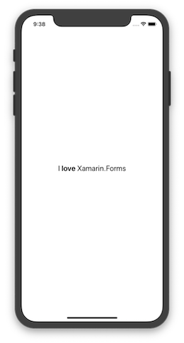

# Formatted Text in F\# with Xamarin.Forms

[Xamarin.Forms docs](https://docs.microsoft.com/xamarin/xamarin-forms/) / [eBook](https://docs.microsoft.com/xamarin/xamarin-forms/creating-mobile-apps-xamarin-forms/) / [Related samples](https://docs.microsoft.com/samples/browse/?term=Xamarin.Forms%20Book)

Simple Xamarin.Forms application for Android and iOS, written in F#. The app shows formatted text spans:



```fsharp
type VariableFormattedTextPage() =
    inherit ContentPage()
    let formattedString = FormattedString()
    let largeSize = Device.GetNamedSize(NamedSize.Large, typeof<Label>)

    do formattedString.Spans.Add(Span(Text = "I "))
    do formattedString.Spans.Add(Span(Text = "love",
                                      FontSize = largeSize,
                                      FontAttributes = FontAttributes.Bold))
    do formattedString.Spans.Add(Span(Text = " Xamarin.Forms"))

    do base.Content <- Label(FormattedText = formattedString,
                             VerticalOptions = LayoutOptions.Center,
                             HorizontalOptions = LayoutOptions.Center,
                             FontSize = largeSize)
```

## Prerequisites

- [Visual Studio](https://visualstudio.microsoft.com/) on Mac or Windows.
  - _Mobile Development with .NET (Xamarin)_ workload installed.
  - F\#
- To test and deploy to iOS devices:  
  - Mac computer with the latest version of macOS.
  - Latest version of [Xcode](https://developer.apple.com/xcode/) from Apple on the Mac.
  - If you're using Windows, the Mac should be available on the network.

## Running the sample

1. Open the solution file (**.sln**) in Visual Studio.
1. Use the **Run** button or menu to start the app.
